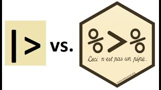

# 🧭

<!-- Centrer les logos et le texte -->
<div style="text-align: center;">

<!-- Logos -->
 <br>
 <br>
<i>Agence nationale de la Statistique et de la Démographie (ANSD)</i> <br>
 <br>
<i>Ecole nationale de la Statistique et de l'Analyse économique Pierre Ndiaye (ENSAE)</i> <br>
<br><br>

<!-- Titre du projet -->
<p style="font-size: 28px; font-weight: bold; color: blue;">
Semestre 2 : Projet statistique avec R
</p>

<p style="font-size: 22px; font-weight: bold;">
 TP10 - Thème 9 - Groupe 8
</p>

<p style="font-size: 28px; font-weight: bold; color: blue;">
Tableaux avec GTSUMMARY
</p>

 <br>


<!-- Informations sur les rédacteurs -->
<p style="font-size: 18px;">
<i>Rédigé par :</i> <br>
<b>RASAMOELINA Nihaviana Albert Paulinah</b> et <b>DIAW AWA</b> <br>
<i>Respectivement Élèves en ISE1 Eco et ISE 1 cycle long</i>
</p>

<br>

<!-- Superviseur -->
<p style="font-size: 18px;">
<i>Sous la supervision de :</i> <br>
<b>M. Aboubacar HEMA</b> <br>
<i>Research Analyst</i>
</p>

<br>

<!-- Année scolaire -->
<p style="font-size: 20px; font-weight: bold;">
Année scolaire : 2024/2025
</p>

</div>

<!----------------------------------FIN DE SCRIPT - Page de garde---------------------------------------->

<!--chapter:end:pdg.Rmd-->

---
title: "Untitled"
author: "Awa D"
date: "24/03/2025"
output: html_document
---


# 📄 Décharge

Les auteurs de ce rapport tiennent à préciser que ce document a été réalisé dans un cadre académique. Ils assument l'entière responsabilité de son contenu. Cela dit, ni l’Ecole nationale de la Statistique et de l’Analyse économique Pierre Ndiaye (ENSAE) ni l’Agence nationale de la Statistique et de la Démographie (ANSD) ne sauraient être tenus responsables d’éventuelles erreurs ou interprétations contenues dans ce travail.


<!-----------------------------------------FIN DE SCRIPT DECHARGE---------------------------------------------->

<!--chapter:end:decharge.Rmd-->

---
title: ""
author: ""
date: ""
output: html_document
---
# 🎯 Avant propos

Ce rapport s’inscrit dans le cadre d'une présentation sanctionnant la fin du cours de Projet statistique avec R.  
À l’issue de ce cours, il nous a été demandé de travailler sur le package gtsummary, en mobilisant les connaissances acquises.  

Ici, nous ne nous arrêterons pas uniquement aux codes, mais nous appliquerons les règles d'un bon script, notamment :  
- Utilisation de références relatives pour un code bien structuré.  
- Commentaires clairs pour expliquer chaque section du code.  
- Illustrations avec des exemples concrets pour faciliter la compréhension.  
- Rédaction du rapport avec Bookdown, une application issue des TP des ISEP. 

L'objectif principal est d'appliquer au mieux les connaissances acquises au cours du semestre.  

Nous tenons à exprimer notre profonde gratitude à l’ANSD ainsi qu’à toute l’équipe pédagogique de l’ENSAE pour les conditions d’apprentissage mises à notre disposition.  

Nous adressons également nos sincères remerciements à M. Aboubacar HEMA, notre professeur de Projet Statistique avec R, pour son encadrement et ses enseignements.  

Enfin, nous remercions chaleureusement nos camarades de classe pour leur collaboration et les échanges enrichissants qui ont jalonné ce projet.  

<!-----------------------------------------FIN DE SCRIPT - A PROPOS---------------------------------------------->

<!--chapter:end:apropos.Rmd-->

---
title: ""
author: ""
date: "24/03/2025"
output: html_document
---
# 📘 Introduction

La fonction tbl_summary() calcule des statistiques descriptives pour les variables continues, catégorielles et dichotomiques dans R, et présente les résultats dans un tableau de synthèse attrayant et personnalisable, prêt à être publié.

Ce bookdown guide le lecteur à travers la fonction `tbl_summary()` et nous y verrons :

- Une introduction aux fonctions clés de `gtsummary` ainsi que leurs paramètres.

- Un cas pratique illustrant son utilisation.

Avant de commencer, installez et chargez le package {gtsummary}.

```{r, echo=TRUE, eval=FALSE}
install.packages("gtsummary")
library(gtsummary)
```

Vous pouvez déjà importer votre jeu de données...

```{r, echo=TRUE, eval=FALSE}

# IMPORTATION DE NOTRE JEU DE DONNEES
library(readr)
dataset <- read_csv("data/ehcvm_welfare_2b_bfa2021.csv")
```


<!---------------------------------------FIN DE SCRIPT - INTRODUCTION-------------------------------------------->

<!--chapter:end:introduction.Rmd-->

---
title: " "
author: ""
date: "24/03/2025"
output: html_document
---

# 📖 Chapitre I. Les principales fonctions de gtsummary et leurs paramètres

Il existe quatre principales manières de personnaliser la sortie du tableau récapitulatif :

- Utiliser les arguments de la fonction `tbl_summary()`

- Ajouter des informations supplémentaires avec les fonctions `add_()`

- Modifier l'apparence du tableau avec les fonctions `gtsummary`

- Modifier l'apparence avec le package `gt`

## 0. Préambule sur les opérateurs de pipe 
Avant d'explorer les fonctionnalités de gtsummary, il est utile de comprendre les opérateurs pipe qui facilitent l'écriture de code dans R :

- Opérateur natif |>
Introduit dans R 4.1, l’opérateur |> permet de simplifier l’écriture des chaînes de traitement. Il envoie la valeur située à sa gauche comme premier argument à la fonction à sa droite. Par exemple :

```{r setup, echo=TRUE, eval=FALSE, include=TRUE}
result <- data |> head(10)
```
équivaut à :
```{r, echo=TRUE, eval=FALSE, include=TRUE}
result <- head(data, 10)
```

- Pipe du tidyverse %>%
Provenant du package magrittr, %>% permet également de chaîner des opérations. Ce pipe est particulièrement flexible et permet d’insérer des appels de fonctions de manière plus naturelle. Par exemple :

```{r, echo=TRUE, eval=FALSE, include=TRUE}
result <- data %>% 
  filter(age > 30) %>% 
  summarise(mean_age = mean(age, na.rm = TRUE))
```
équivaut à : 

```{r, echo=TRUE, eval=FALSE, include=TRUE}
filtered_data <- filter(data, age > 30)
result <- summarise(filtered_data, mean_age = mean(age, na.rm = TRUE))
```

 <br>

Les deux pipes offrent une syntaxe fluide et lisible. La différence majeure réside dans la compatibilité avec d’autres packages et dans certaines subtilités syntaxiques, mais dans la pratique, ils remplissent le même rôle.

## 1. La fonction tbl_summary()

**Description :**  
`Cette fonction peut prendre, au minimum, un data frame comme seul argument d'entrée et renvoie des statistiques descriptives pour chaque colonne du data frame.
```{r, echo=FALSE, eval=TRUE}

# IMPORTATION
library(readr)
dataset <- read_csv("data/ehcvm_welfare_2b_bfa2021.csv")
View(dataset)
head(dataset)
names(dataset)
```

```{r}
library(gtsummary)
dataset |> tbl_summary(include = c(hage, hmstat))
```

**Arguments clés :**
La fonction tbl_summary() propose plusieurs options pour modifier l'apparence du tableau récapitulatif. Voici un aperçu des principaux arguments :

- **type** :	Définit le type de variable (ex. : continue, catégorielle, etc.).
- **sort** :	Trie les niveaux d’une variable catégorielle par fréquence.
- **percent** :	Définit si les pourcentages doivent être affichés par colonne, ligne ou cellule.
- **by** : Permet de stratifier les statistiques selon une variable spécifique (par exemple, pour comparer les groupes).
- **label** : Personnalise les étiquettes affichées pour les variables.
- **statistic** : Définit les statistiques à afficher pour chaque variable, en utilisant souvent la syntaxe {glue} (ex. : `"{mean} ({sd})"`).
- **digits** : Spécifie le nombre de décimales à utiliser pour l’affichage des statistiques.
- **missing** : Indique s’il faut afficher une ligne avec le nombre de valeurs manquantes ("ifany" : Affichage explicite des valeurs manquantes si elles existent)
- **include** : Liste des variables à inclure dans le tableau.

**Exemple de script :**

```{r}
library(dplyr)
library(gtsummary)
tbl_summary_examplesimple <- dataset %>%
  tbl_summary(
    by = hgender,  # Stratification : les statistiques sont calculées séparément pour chaque sexe
    include = hage,  # Seule 'hage' est dans le tableau
    label = hage ~ "Age du chef de ménage",  
    statistic = all_continuous() ~ "{mean} ({sd})",  # Pour les variables continues, afficher la moyenne et l'écart-type
    digits = all_continuous() ~ 2,  # Val nom avec 2 décimales
    missing = "ifany"  # Affichage explicite des valeurs manquantes si elles existent
  )
# Affichage du tableau
tbl_summary_examplesimple
```
Exemple d'interprétation : 

- L’échantillon est dominé par des hommes, qui représentent la grande majorité des chefs de ménage (6 101 contre 1 075).
- En moyenne, les chefs de ménage féminins sont plus âgés (47.97 ans) que les chefs de ménage masculins (45.27 ans).
- De plus, la variabilité de l'âge des chefs de ménage est légèrement plus élevée chez les femmes (15.37  contre 14.50).

Allons plus loin en incluant plusieurs variables dans notre tableau ...

```{r, echo=TRUE, eval=TRUE}
library(gtsummary)
library(dplyr)
# Création d'un tableau de synthèse stratifié par la variable 'hage'
tbl_summary_example <- dataset %>%
  tbl_summary(
    by = hgender,  
    include = c(hage, hhsize, hmstat, hreligion, hdiploma, hhandig),  # Toutes ces variables seront incluses dans le tableau
    label = list(
      hage ~ "Âge du chef de ménage",  
      hhsize ~ "Taille du ménage",  
      hmstat ~ "Statut matrimonial du chef de ménage", 
      hreligion ~ "Religion",  
      hdiploma ~ "Plus haut diplôme du chef de ménage", 
      hhandig ~ "Des handicapés dans le ménage ?"  
    ),  
    statistic = all_continuous() ~ "{mean} ({sd})",  
    digits = all_continuous() ~ 2,  
    missing = "ifany"  
  )

# Affichage du tableau
tbl_summary_example
```


## 2. Fonctions d’ajout d’informations

### a. add_overall()

**Description :**  
Ajoute une colonne contenant les statistiques globales (non stratifiées), en complément de celles affichées par groupe.

**Paramètres importants :**

- **last** : Positionne la colonne globale à la fin du tableau (TRUE/FALSE).
- **col_label** : Permet de personnaliser l’intitulé de la colonne globale.

**Exemple de script :**

```{r, echo=TRUE, eval=TRUE}
tbl_summary_overall <- tbl_summary_example %>%
  add_overall(
    last = TRUE,
    col_label = "**Colonne des totaux** {N}"
  )

tbl_summary_overall
```
Exemple d'interprétation : 

- L'échantillon total comprend 7,176 chefs de ménage.
- L'âge moyen global est 45.68 ans tandis que l'écart-type global est 14.67 ans.

### b. add_n()

**Description :**  
Ajoute une colonne indiquant le nombre d’observations (ou le nombre d’observations non manquantes) pour chaque variable.

**Paramètres importants :**

- **col_label** : Modifie l’intitulé de la colonne.
- **statistic** : Permet de définir le format d’affichage des effectifs.
- **footnote** : Ajoute une note de bas de tableau explicative.

**Exemple de script :**

```{r, echo=TRUE, eval=TRUE, include=TRUE}
tbl_summary_with_n <- tbl_summary_example %>%
  add_n(
    col_label = "**Effectif**",  # Intitulé de la colonne
    statistic = "{N_nonmiss}",  # Affichage des effectifs et des pourcentages
  ) %>%
  modify_table_styling(
    columns = everything(),
    footnote = "Nbre d'observations non manquantes"
  )

# Afficher le tableau final
tbl_summary_with_n
```

Dans cet exemple, nous avons utilisé uniquement les fonctions add_n() et add_overall() de {gtsummary} pour enrichir notre tableau de synthèse. 

Cependant, il existe d'autres fonctions comme add_p() pour ajouter des p-values pour comparer les groupes, add_difference() pour calculer la différence entre deux groupes avec l'intervalle de confiance et la p-value associée, ou encore add_stat_label() pour ajouter des étiquettes aux statistiques affichées. Nous n'avons pas utilisé ces fonctions ici, car elles nécessitent la mise en œuvre de tests statistiques, ce que nous n'avons pas encore couvert dans le cadre de notre formation. 

## 3. Fonctions de personnalisation du tableau

Ces fonctions de formatage de table proposées par {gtsummary} permettent de modifier l’aspect du tableau après sa création.
- modify_header() : Met à jour les en-têtes de colonnes.

```{r, echo=TRUE, eval=TRUE, include=TRUE}
# Modifier les en-têtes des colonnes
tbl_summary_modified <- tbl_summary_example %>%
  modify_header(stat_1 ~ "**Femmes**",  # Personnaliser l'en-tête de la 1ere colonne des statistiques
    stat_2 ~ "**Hommes**"  # pour la 2e
    )

# Afficher le tableau modifié
tbl_summary_modified
```
- modify_footnote_header() : Met à jour la note de bas de colonne dans l'en-tête.

- modify_footnote_body() : Met à jour la note de bas de colonne dans le corps du tableau.

- modify_spanning_header() : Met à jour les en-têtes englobants (spanning headers).

- modify_caption() : Met à jour la légende du tableau (titre).

- bold_labels() : Met en gras les étiquettes des variables.

- bold_levels() : Met en gras les niveaux des variables.

- italicize_labels() : Met en italique les étiquettes des variables.

- italicize_levels() : Met en italique les niveaux des variables.

- bold_p() : Met en gras les p-values significatives.

```{r, echo=TRUE, eval=TRUE, include=TRUE}
# Charger les bibliothèques nécessaires
library(gtsummary)
library(dplyr)

# Créer le tableau de synthèse personnalisé
tbl_summary_personalized <- dataset %>%
  tbl_summary(
    by = hmstat,
    include = c(hage, hhsize)  # Sélection des variables
  ) %>%
  add_overall() %>%  # Ajouter une colonne avec les statistiques globales
  add_n() %>%  # Ajouter une colonne avec N (ou N manquants)
  modify_header(label ~ "**Variable**") %>%  # Modifier l'en-tête des variables
  modify_spanning_header(c("stat_1", "stat_2") ~ "**Etat matrimonial**") %>%  # Ajouter des en-têtes englobants
  #modify_footnote(c("Median (IQR)", "Frequency (%)")) %>%  # Modifier les notes de bas de page
  modify_caption("**Tableau modifié. Personnalisation**") %>%  # Ajouter une légende
  bold_labels() %>%  # Mettre en gras les étiquettes des variables
  italicize_labels() 
# Afficher le tableau modifié
tbl_summary_personalized

```

## 4. Personnalisation de l'apparence avec les thèmes gtsummary

Le package gtsummary offre plusieurs thèmes intégrés pour personnaliser l'apparence des tableaux générés, permettant ainsi d'adapter l'affichage en fonction du contexte d'utilisation (publication académique, rapport professionnel, etc.). Ces thèmes influencent l'aspect général du tableau, comme l'espacement, la mise en forme des en-têtes et des colonnes, ainsi que l'agencement des lignes et des bordures.

### a. Le thème theme_gtsummary_journal()

Ce thème est conçu pour les publications académiques. Il donne aux tableaux un aspect formel, avec des bordures nettes et un espacement plus large entre les lignes, ce qui facilite la lisibilité dans un contexte académique.

```{r, echo=TRUE, eval=TRUE, include=TRUE}
set_gtsummary_theme(theme_gtsummary_journal())  # Appliquer le thème 'journal'
dataset |> tbl_summary(include = c(hage, hmstat))
```


### b. Le thème theme_gtsummary_compact()
Ce thème est plus compact et réduit l'espacement entre les lignes et les colonnes, ce qui est utile pour des tableaux denses où vous souhaitez économiser de l'espace.
```{r, echo=TRUE, eval=TRUE, include=TRUE}
set_gtsummary_theme(theme_gtsummary_compact())  # Appliquer le thème 'compact'
dataset |> tbl_summary(include = c(hage, hmstat))
```
### c. Autres thèmes
Les autres thèmes incluent :
- Le thème theme_gtsummary_minimal()
Ce thème offre une présentation simple et épurée, idéale pour des rapports où une mise en page sobre et sans distraction est préférée. Il minimise les bordures et utilise un design plus léger.

- Le thème theme_gtsummary_striped() 
Ce thème ajoute des bandes alternées aux lignes du tableau pour améliorer la lisibilité, particulièrement utile pour des tableaux longs ou complexes où la distinction entre les lignes peut être difficile sans cette séparation visuelle.

- Le thème theme_gtsummary_merged() 
Ce thème est orienté vers des tableaux où des cellules peuvent être fusionnées pour offrir une apparence plus uniforme et cohérente. Il est souvent utilisé pour les tableaux présentant des regroupements de variables.

- Le thème theme_gtsummary_dark() 
Ce thème crée une présentation avec des couleurs sombres, offrant un design adapté aux interfaces de type "mode sombre". Il est utile lorsque vous présentez vos données dans des environnements sombres ou lorsque vous souhaitez donner un aspect plus moderne à vos rapports.


Il est aussi possible de regrouper plusieurs tableaux avec tbl_stack. Nous verrons l'application dans la partie qui suit.


<!---------------------------------------FIN DE SCRIPT - Chapitre 1-------------------------------------------->


<!--chapter:end:chapitre1.Rmd-->

---
title: " "
author: ""
date: "24/03/2025"
output: html_document
---

# 📖 Chapitre II. Applications pratiques

## 0. Consigne

### Projet :
Évaluation des politiques de transfert monétaire sur la pauvreté et les inégalités au Burkina Faso, à l’aide des données de l’EHCVM 2021.

### Scénarios simulés :
- Scénario 1 : Transfert universel — Tous les ménages reçoivent une allocation annuelle de 100 000 CFA.
- Scénario 2 : Transfert universel rural — Seuls les ménages ruraux reçoivent l’allocation.
- Scénario 3 : Chef de ménage femme — Transfert ciblé aux ménages dirigés par une femme.
- Scénario 4 : Chef polygame — Transfert aux ménages dont le chef est polygame.
- Scénario 5 : Handicap — Transfert aux ménages comprenant au moins un membre en situation de handicap.


## 1. Chargement et exploration des données EHCVM 2021

####  Objectif

Utiliser le package `gtsummary` pour explorer, résumer et mieux comprendre les variables clés.

#### Variables importantes

| Variable | Description |
|---------|-------------|
| `pcexp` | Dépense par tête (proxy du revenu) |
| `hhsize` | Taille du ménage |
| `milieu` | Milieu de résidence (`urbain` ou `rural`) |
| `hmstat` | Statut matrimonial du chef de ménage |
| `hgender` | Sexe du chef de ménage |
| `zref` | Seuil de pauvreté national |
| `hhandig` | S'il y a des handicapés dans le ménage |

## 2. Chargement des données

#### Lecture du fichier

```{r, echo=TRUE, eval=TRUE, warning=FALSE, message=FALSE, results='hide'}
library(readr)

# Chargement du jeu de données EHCVM
dataset <- read_csv("data/ehcvm_welfare_2b_bfa2021.csv")
vars_interet <- c("hhid", "milieu", "pcexp","hmstat", "hhsize","hhandig", "hgender", "zref")
datasetapp <- dataset %>% 
  select(all_of(vars_interet))
```

## 3. Exploration préliminaire
#### Aperçu des premières lignes

```{r, echo=F, eval=TRUE, warning=FALSE, message=FALSE}
head(datasetapp)
str(datasetapp)
```

#### Dimensions de la base
```{r, echo=F, eval=TRUE, warning=FALSE, message=FALSE}
dim(datasetapp)
```


#### Vérification de la qualité des données


```{r, echo=F, eval=TRUE, warning=FALSE, message=FALSE}
# Pourcentage de valeurs manquantes
missing_data <- colSums(is.na(datasetapp)) / nrow(datasetapp) * 100
# Filtre
missing_data <- missing_data[missing_data > 0]

# Affichage
if (length(missing_data) == 0) {
  cat("✅ Il n'y a pas de valeurs manquantes dans le dataset.\n")
} else {
  cat("❌ Pourcentage de valeurs manquantes par variable :\n")
  print(missing_data)
}

```

```{r, echo=F, eval=TRUE, warning=FALSE, message=FALSE}
# Nombre de doublons
duplicate_count <- nrow(datasetapp[duplicated(datasetapp), ])
if (duplicate_count == 0) {
  cat("✅ Il n'y a pas de doublons dans le dataset.\n")
} else {
  cat("❌ Il y a", duplicate_count, "doublon(s) dans le dataset.\n")
}
```


## 4. CORRECTION

Évaluation des politiques de transfert monétaire sur la pauvreté et les inégalités au Burkina Faso

### Introduction

Les programmes de transfert monétaire constituent une approche de protection sociale de pour lutter contre la pauvreté.

### Méthodologie

#### 1. Préparation des données

Commençons par charger les bibliothèques nécessaires et les données de l'EHCVM 2021.

```{r,echo=FALSE}
# Installer les packages si nécessaire
required_packages <- c("readr", "dplyr", "ggplot2", "gtsummary", "patchwork", "ineq", "kableExtra")

# Vérifier si chaque package est installé, sinon l'installer
new_packages <- required_packages[!(required_packages %in% installed.packages()[,"Package"])]
if(length(new_packages)) install.packages(new_packages)

# Charger les bibliothèques
library(readr)
library(dplyr)
library(ggplot2)
library(gtsummary)
library(patchwork)
library(ineq)     # Pour le calcul du coefficient de Gini
library(kableExtra)
```

#### 2. Exploration des données Avec gtsummary

Avant de procéder aux simulations, examinons les caractéristiques de notre jeu de données.

ON VA METTRE DES TABLEAUX POUR CHAQUE VARIABLE. APRES ON VA CONCATENER LES TABLEAUX AVEC tbl_stack

```{r,echo=FALSE}
# Résumé des statistiques descriptives
summary_stats <- datasetapp %>%
  tbl_summary(
    include = c(pcexp, hhsize, hmstat, hgender, milieu, hhandig),
    label = list(
      pcexp ~ "Dépenses par tête (FCFA)",
      hhsize ~ "Taille du ménage",
      hmstat ~ "Statut matrimonial du chef",
      hgender ~ "Genre du chef",
      milieu ~ "Milieu de résidence",
      hhandig ~ "Présence de handicapés"
    ),
    statistic = list(
      all_continuous() ~ "{mean} ({max},{min},{sd})",
      all_categorical() ~ "{n} ({p}%)"
    ),
    digits = all_continuous() ~ 2,
    missing = "ifany"
  ) %>%
  modify_caption("Tableau 1. Caractéristiques des ménages burkinabè (EHCVM 2021)")

summary_stats
```

#### 3. Résultats des simulations

```{r,echo=FALSE,eval=T}
# Définition du seuil de pauvreté (zref)
# Création de variables pour l'analyse de la pauvreté
data_baseline <- datasetapp %>%
  mutate(
    pauvre = pcexp < zref,
    gap = ifelse(pauvre, zref - pcexp, 0),
    gap_normalise = gap / zref,
    gap_normalise_carre = gap_normalise^2
  )

# Calcul des indices FGT initiaux
fgt0_initial <- sum(data_baseline$pauvre * data_baseline$hhsize) / sum(data_baseline$hhsize)
fgt1_initial <- sum(data_baseline$gap_normalise * data_baseline$hhsize) / sum(data_baseline$hhsize)
fgt2_initial <- sum(data_baseline$gap_normalise_carre * data_baseline$hhsize) / sum(data_baseline$hhsize)

# Calcul du coefficient de Gini initial
gini_initial <- ineq(data_baseline$pcexp, type = "Gini")

# Affichage des indices initiaux
indices_initiaux <- data.frame(
  Indicateur = c("Incidence (FGT0)initial", "Profondeur (FGT1)initial", "Sévérité (FGT2)initial", "Giniinitial"),
  Valeur = c(fgt0_initial, fgt1_initial, fgt2_initial, gini_initial)
)

```


```{r,echo=FALSE,eval=T}
### 4. Simulation des scénarios de transfert monétaire
# Montant du transfert par ménage (annuel)
montant_transfert <- 100000

# Fonction pour simuler un transfert et calculer les indices
simuler_transfert <- function(dataset, condition, nom_scenario) {
  
  data_sim <- dataset %>%
    mutate(
      beneficiaire = condition,
      transfert = ifelse(beneficiaire, montant_transfert / hhsize, 0),
      pcexp_new = pcexp + transfert,
      pauvre_new = pcexp_new < zref,
      gap_new = ifelse(pauvre_new, zref - pcexp_new, 0),
      gap_normalise_new = gap_new / zref,
      gap_normalise_carre_new = gap_normalise_new^2
    )
  
  # Calcul des indices FGT post-transfert
  fgt0_new <- sum(data_sim$pauvre_new * data_sim$hhsize) / sum(data_sim$hhsize)
  fgt1_new <- sum(data_sim$gap_normalise_new * data_sim$hhsize) / sum(data_sim$hhsize)
  fgt2_new <- sum(data_sim$gap_normalise_carre_new * data_sim$hhsize) / sum(data_sim$hhsize)
  
  # Coefficient de Gini post-transfert
  gini_new <- ineq(data_sim$pcexp_new, type = "Gini")
  
  # Coût total du programme
  cout_total <- sum(data_sim$transfert * data_sim$hhsize)
  
  # Réduction du gap de pauvreté
  efficacite <- sum((dataset$gap - data_sim$gap_new) * data_sim$hhsize) / cout_total
  
  return(list(
    scenario = nom_scenario,
    fgt0 = fgt0_new,
    fgt1 = fgt1_new,
    fgt2 = fgt2_new,
    gini = gini_new,
    cout = cout_total,
    efficacite = efficacite,
    data = data_sim
  ))
}

# Lancement des différents scénarios
scenario1 <- simuler_transfert(data_baseline, TRUE, "Universel")
scenario2 <- simuler_transfert(data_baseline, data_baseline$milieu == "Rural", "Rural")
scenario3 <- simuler_transfert(data_baseline, data_baseline$hgender == "Féminin", "Femme chef")
scenario4 <- simuler_transfert(data_baseline, data_baseline$hmstat == "Marié(e) polygame", "Polygames")
scenario5 <- simuler_transfert(data_baseline, data_baseline$hhandig == "Oui", "Handicap")
```

#### 4. Comparaison des différents scénarios
```{r,echo=FALSE,eval=T}
# Compilation des résultats
resultats_scenarios <- bind_rows(
  data.frame(Scenario = scenario1$scenario, FGT0 = scenario1$fgt0, FGT1 = scenario1$fgt1, FGT2 = scenario1$fgt2, Gini = scenario1$gini, Cout = scenario1$cout, Efficacite = scenario1$efficacite),
  data.frame(Scenario = scenario2$scenario, FGT0 = scenario2$fgt0, FGT1 = scenario2$fgt1, FGT2 = scenario2$fgt2, Gini = scenario2$gini, Cout = scenario2$cout, Efficacite = scenario2$efficacite),
  data.frame(Scenario = scenario3$scenario, FGT0 = scenario3$fgt0, FGT1 = scenario3$fgt1, FGT2 = scenario3$fgt2, Gini = scenario3$gini, Cout = scenario3$cout, Efficacite = scenario3$efficacite),
  data.frame(Scenario = scenario4$scenario, FGT0 = scenario4$fgt0, FGT1 = scenario4$fgt1, FGT2 = scenario4$fgt2, Gini = scenario4$gini, Cout = scenario4$cout, Efficacite = scenario4$efficacite),
  data.frame(Scenario = scenario5$scenario, FGT0 = scenario5$fgt0, FGT1 = scenario5$fgt1, FGT2 = scenario5$fgt2, Gini = scenario5$gini, Cout = scenario5$cout, Efficacite = scenario5$efficacite)
)

# Ajout des valeurs de référence (baseline) pour comparaison
indices_reference <- data.frame(
  Scenario = "Scénario 0 : sans transfert",
  FGT0 = fgt0_initial,
  FGT1 = fgt1_initial,
  FGT2 = fgt2_initial,
  Gini = gini_initial,
  Cout = 0,
  Efficacite = NA
)

resultats_complets <- bind_rows(indices_reference, resultats_scenarios)

# Affichage sous forme de tableau
print(resultats_complets)

ggplot(resultats_long, aes(x = Scenario, y = Valeur, fill = Scenario)) +
  geom_col(show.legend = FALSE) +
  facet_wrap(~ Indicateur, scales = "free_y") +
  labs(title = "Comparaison des scénarios pour chaque indicateur",
       x = "Scénario de transfert", y = "Valeur de l'indicateur") +
  theme_minimal() +
  theme(axis.text.x = element_text(angle = 45, hjust = 1))


```

#### Conclusion

Le ciblage universel est le plus efficace en termes d’impact brut avec une forte réduction de la pauvreté FGT0 : 0.354 (vs 0.390), FGT1 : 0.099, FGT2 : 0.038, Gini : 0.395,mais cela se fait au prix du coût le plus élevé : 717 600 000 FCFA, pour une efficacité modérée (27.95 %).

Le ciblage polygame est le plus efficient (Efficacité : 42.96 %, coût : 157 200 000 FCFA),
avec une réduction notable des indices  (FGT1 : 0.110 vs 0.116, FGT2 : 0.044).

Le ciblage rural constitue une stratégie équilibrée avec un impact significatif (FGT1 : 0.103), un coût raisonnable : 383 800 000 FCFA et bonne efficacité : 39.29 %.

Des scénarios combinés comme rural + femme chef ou polygame + présence d'handicapés pourraient permettre une réduction significative de la pauvreté à moindre coût, tout en assurant une meilleure ciblage des plus vulnérables.


### Annexe : Définitions et formules

Indices FGT (Foster-Greer-Thorbecke) :

- FGT0 (Incidence) : Proportion de la population vivant sous le seuil de pauvreté

$$FGT_0 = \frac{1}{N} \sum_{i=1}^{N} \mathbf{1}(pcexp_i < z)$$
- FGT1 (Profondeur) : Écart moyen normalisé entre le revenu des pauvres et le seuil de pauvreté

$$FGT_1 = \frac{1}{N} \sum_{i=1}^{N} \left( \frac{z - pcexp_i}{z} \right) \mathbf{1}(pcexp_i < z)$$

- FGT2 (Sévérité) : Moyenne des carrés des écarts normalisés, donnant plus de poids aux plus pauvres

$$FGT_2 = \frac{1}{N} \sum_{i=1}^{N} \left( \frac{z - pcexp_i}{z} \right)^2 \mathbf{1}(pcexp_i < z)$$

Coefficient de Gini : Mesure de l'inégalité de la distribution des revenus au sein d'une hhsizeulation (0 = égalité parfaite, 1 = inégalité maximale)

$$G = \frac{\sum_{i=1}^{N} \sum_{j=1}^{N} |pcexp_i - pcexp_j|}{2 N^2 \bar{pcexp}}$$

où :  

- $N$ est la population totale,  

- $pcexp_i$ est la dépense de consommation par tête du ménage $\( i \)$,  

- $z$ est le seuil de pauvreté,  

- $\mathbf{1}(pcexp_i < z)$ est une fonction indicatrice qui vaut 1 si $pcexp_i < z$, sinon 0,  

- $\bar{pcexp}$ est la moyenne des dépenses de consommation par tête.

- Efficacité du transfert : Ratio entre la réduction du gap de pauvreté et le coût total du programme de transfert


<!-------------------------------FIN DE SCRIPT - Chapitre 2------------------------------------->

<!--chapter:end:chapitre2.Rmd-->

---
title: ""
author: ""
date: "24/03/2025"
output: html_document
---

# 📑 Conclusion

Le package gtsummary s’impose comme un outil incontournable pour la création de tableaux de synthèse statistiques en R.  
Son intégration fluide avec le tidyverse et son large éventail de fonctions de personnalisation en font un choix idéal pour produire des rapports clairs, lisibles et adaptés aux exigences des publications scientifiques.  

Synthèse des points abordés
Dans cette présentation, nous avons exploré :  
- Les fonctionnalités principales de `gtsummary`.  
- Ses applications pratiques à travers des exemples concrets.  

Grâce à ce package, les utilisateurs peuvent automatiser et standardiser la présentation de leurs analyses, tout en garantissant une interprétation efficace des résultats.  
En maîtrisant ses principales fonctions et paramètres, il devient possible d’améliorer considérablement la lisibilité des tableaux tout en optimisant le temps de production des rapports.

Perspectives
Ce travail pourrait être enrichi par l’exploration des modèles statistiques dans `gtsummary`.

Ces perspectives permettraient d’aller plus loin en appliquant `gtsummary` non seulement aux descriptions de données, mais aussi aux modèles d’analyse avancés.  


<!---------------------------------------FIN DE SCRIPT - CONCLUSION-------------------------------------------->

<!--chapter:end:conclusion.Rmd-->

---
title: ""
author: "Awa D"
date: "24/03/2025"
output: html_document
---

# 📚 Références 

La rédaction de ce bookdown sur `gtsummary` s'appuie sur plusieurs ressources officielles et tutoriels détaillés.  

### Documentation officielle et tutoriels  
- [Documentation complète de gtsummary (CRAN)](https://cran.r-project.org/web/packages/gtsummary/gtsummary.pdf)  
- [Guide d’utilisation de `tbl_summary()`](https://www.danieldsjoberg.com/gtsummary/articles/tbl_summary.html)  
- [Utilisation de gtsummary dans R Markdown](https://www.danieldsjoberg.com/gtsummary/articles/rmarkdown.html)  

### Autres ressources utiles 
- [Analyse de données avec gtsummary](https://larmarange.github.io/analyse-R/gtsummary.html)  
- [Présentation du package sur le blog de RStudio](https://education.rstudio.com/blog/2020/07/gtsummary/)  
- [Dépôt GitHub officiel de gtsummary](https://github.com/ddsjoberg/gtsummary)


<!-----------------------------------------FIN DE SCRIPT REFERENCES---------------------------------------------->

<!--chapter:end:references.Rmd-->

